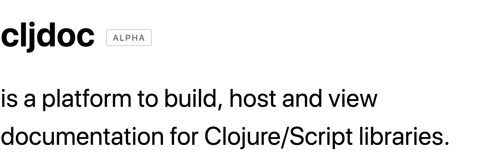

[](https://circleci.com/gh/cljdoc/cljdoc)

An effort to create a central documentation hub for the Clojure & ClojureScript ecosystem.

> :wave: Need help getting started? Say hi on [Telegram](https://telegram.me/martinklepsch), [Twitter](https://twitter.com/martinklepsch) or [Clojurians Slack](http://clojurians.net/) in [#cljdoc](https://clojurians.slack.com/messages/C8V0BQ0M6/).

## Rationale

Publishing Clojure library documentation is an often manual and error
prone process. Library authors who want to provide documentation need
to set up tooling to create such documentation, host it and keep it
updated. In combination all these steps introduce a significant amount
of friction that often leads to there not being any HTML documentation
at all. If there is documentation it's often only a matter of time until
it's out of date with the latest release.

**In short:** Publishing documentation is hard. Harder than it has to be.

By fully automating the process of publishing documentation we can take
a great burden from the shoulders of library maintainers and let them focus
on shipping great libraries with great documentation.

A central place and consistent UI for all Clojure/Script library
documentation will also make it easier for developers to find and work
with documentation.

By centralizing this publishing process we can also build up a global
understanding of the Clojure/Script ecosystem enabling many more
interesting use-cases down the road.

#### Goals

- Provide an easy way to host library documentation for Clojure/Script library authors
- Deal with all the boring stuff: hosting, updating, keeping old versions around
- Build an ecosystem-encompassing database (+ API) of artifacts, namespaces and their contents.
- Support API documentation, articles and examples.
- Encourage the writing of more and better documentation.

## Contributing

To start the entire system, simply run:

```
./script/cljdoc run
```

After that the server will start under http://localhost:8000/. You can
navigate to a projects documentation page like
http://localhost:8000/d/bidi/bidi/2.1.3/ and request a build. This
will analyze Bidi's source code locally and store the result. After
that is done you can reload the page and view the documentation.

Logs can be viewed with `tail -f log/cljdoc.log`.

:recycle: For a more REPL-driven workflow, check the comment block at the end of
the `cljdoc.server.system` namespace.

**Tests:** There is a small amount of tests which can be ran with `clj -A:test`.

#### ADRs

I've been looking for an opportunity to use [ADRs](http://thinkrelevance.com/blog/2011/11/15/documenting-architecture-decisions) for some time, you can find them all in [`doc/adr/`](https://github.com/cljdoc/cljdoc/tree/master/doc/adr).


## License

`EPL-2.0` see `LICENSE`
