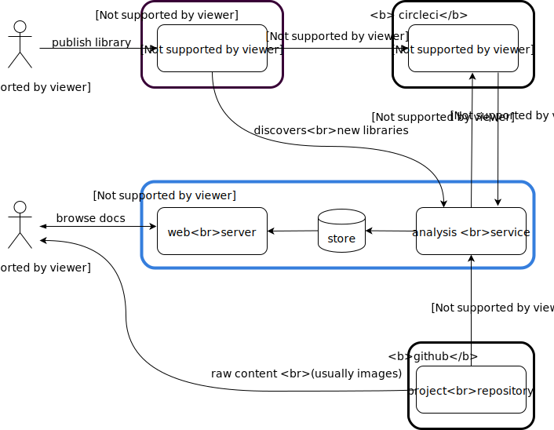

= cljdoc Developer Technical Guide
:toc:

== Introduction

So you'd like to contribute your development skills to cljdoc itself? This is great!

You'll first want to read link:../CONTRIBUTING.adoc[Contributing] and familiarize yourself with
the link:CODE_OF_CONDUCT.adoc[Code of Conduct].

This document is a collection of technical notes that should be useful to a cljdoc developer.
If you find there is something missing from this doc that stumped you, we would greatly
appreciate you letting us know.

== Related developer docs
You can learn how to setup a local development environment in link:running-cljdoc-locally.adoc[Running cljdoc locally].

Being aware of how to diagnose and fix analysis job builds will also be of use, see link:fixing-builds.md[fixing cljdoc builds].

[[system-overview]]
== System Overview

You'll find a detailed deployment description of cljdoc under the link:../ops[ops directory] but here is
what cljdoc looks like in production in broad strokes:



A library author publishes to clojars. When the cljdoc analysis service
discovers the new library, it initiates two tasks:

. it launches an api analysis job on circleci
. clones the library's project from github for library docs, info and file mappings.

The results of the analysis tasks are then stored in an internal cljdoc database.
The cljdoc web site then draws on this database to present library docs to cljdoc users.

Note that while most Clojure developers host their source on github, gitlab and
bitbucket are also supported source code repositories.

== Database Overview

=== SQLite

Cljdoc makes use of two https://sqlite.org[SQLite] databases.
The schemas are small and simple.

Some data is stored in nippy blobs.
Nippy is fast and stores data compactly, but makes data opaque when viewing a raw database.
This little database overview diagram should help.

image::database-overview.svg[]

Historical notes:

* `builds.error_info` is obsolete.
** It stored a nippy blob of the exception object
** It is replaced by `builds.error_info_map`, which stores a nippy blob of a map representation of the exception

Tips:

* You'll find the SQLite databases under the `data` dir.
* Using more modern features of SQLite can be problematic.
Features such as renaming a column, for example.
Cljdoc developers often use MacOS, and it bundles an older version of SQLite.
* You might find a tools such as the  https://sqlitebrowser.org/[DB Browser for SQLite] useful.
* It can sometimes be useful to work locally with a backup of the production databases.
Reach out on Slack if you think this would be helpful to you.

=== Lucene

Cljdoc supports full text querying for libraries with a https://lucene.apache.org/[Lucene] index.

The Lucene index allows cljdoc users to search all available libraries, not necessarily just the ones cljdoc has already built docs for. Available libraries are automatically sourced from:

* Clojars via `\https://clojars.org/repo/feed.clj.gz` daily, and updates by the minute via the `\https://clojars.org/search` API.
* Maven Central via `\https://search.maven.org` https://central.sonatype.org/search/rest-api-guide/[API].
Not many Clojurians host on Maven Central but, quite notably, the Clojure core team does.
We only fetch for a list of explicit group-ids and are happy to update this list on request.

At the time of this writing we index:

* `group-id` & `artifact-id` - we also store an exact untokenized version of these to support exact matches
* `blurb` - a shortened description from the library's pom
* `origin` - either `clojars` or `maven-central` (not currently searched but presented)
* `versions` - a list of all available library versions is stored unindexed, we present available library versions in various spots throughout the cljdoc web site.

At index time, we incorporate clojars download stats, stored in our SQLite `clojars_stats` table, as popularity ranking.

Lucene is powerful, fast and widely used.
It can also be a bit overwhelming to wade through its many features and options, many of which have evolved over decades.

Tips

* You'll find the Lucene index under `data/index-lucene-{some identifiter}`.
Feel free to change `{some-identifier}` when making an incompatible change to the Lucene index.
(As of this writing specified under `index-dir` in the `cljdoc.server.system` ns).
Lucene will simply create a fresh new index.
* Luke is a useful tool to take a peek at your Lucene index.
Download https://lucene.apache.org/core/downloads.html[a full Lucene binary release], unpack it and then launch luke via the `bin/luke.sh` script.

== Testing OpenSearch

Cljdoc includes OpenSearch support for searching for Clojure libraries.
It also supports the OpenSearch Suggestions extension.
Supporting OpenSearch means a website can be used as a search engine in the end user's web browser.

Many websites offer this support: Ebay, DuckDuckGo, Google, Bing, to name some.

So great, but what does this look like and how do I test it?

Here's what I've learnt to do with Firefox (I'm using Firefox Developer Edition v100 as of this writing).

Type anything in your url bar:

image::opensearch-engines.png[]

If you see cljdoc in there, delete it via settings.

Now navigate to the site you want to test, this is likely `\http://localhost:8000` if you are testing locally, but could be `\https://cljdoc.org` if you are hitting production.
Repeat typing `anything`.
Now you should see cljdoc as available to install, click on it to install it.

image::opensearch-install-cljdoc.png[]

Finally click on the cljdoc icon to select it, and you should be testing cljdoc's OpenSearch suggestions support:

image::opensearch-search-cljdoc.png[]

For this example, the browser reaches out to get suggestions by hitting:

* `\http://localhost:8000/api/search-suggest?q=best` - when running locally
* `\https://cljdoc.org/api/search-suggest?q=best` - when running in production

TIP: It is important to remove and re-add the cljdoc search engine from your browser when moving between local dev and production.
The `opensearch.xml` file that web browser consults to learn about cljdoc's OpenSearch capabilities is updated dynamically to target the correct environment.

Resources:

* https://developer.mozilla.org/en-US/docs/Web/OpenSearch[Mozilla's docs on the subject] - includes some useful troubleshooting tips.
* https://github.com/dewitt/opensearch[An archive of the OpenSearch spec] - as of this writing, it is a bit of an oddly formatted shambles, but it is useful none-the-less.

== Offline Docsets

=== Manually Invoking

Cljdoc allows its users to download its docs for offline use.

NOTE: Offline use is currently a bit of an exageration, we don't for example, include referenced images in the download.

A cljdoc user invokes this feature via a download URL.
For example, a user browsing docset:

`\https://cljdoc.org/d/org.clj-commons/clj-http-lite/0.4.392`

Would request a download of this docset via:

`\https://cljdoc.org/*download*/org.clj-commons/clj-http-lite/0.4.392`

Which results in zip file `clj-http-lite-0.4.392.zip`.

=== Dash Integration

I don't know, but I'm guessing that folks don't typically download docsets manually.
I expect they mostly download cljdoc docsets indirectly via https://kapeli.com/dash[Dash], an API document browser available for macOS.

As a cljdoc developer, it is useful for us to understand how Dash uses cljdoc docsets.

Dash offers cljdoc support via a "3rd party source", here's what that looks like at the time of this writing:


Let's assume a Dash user is interested in docs for rewrite-clj:

. The Dash user types in `rewrite` in the search box
.. For each key entered, the Dash app hits the cljdoc search api, the final request would be: +
`\https://cljdoc.org/api/search?q=rewrite`.
.. Cljdoc responds to each request with matching library docsets.
. The Dash app presents the matching docsets for download to the Dash user.
. The Dash user sees rewrite-clj in the list and requests to see all versions.
.. The Dash app requests a json response for: +
`\https://cljdoc.org/versions/rewrite-clj/rewrite-clj?all=true` +
(Dash will also hit this endpoint when checking for available updates of a docset).
.. Cljdoc responds with all known versions of rewrite-clj.
. The Dash app presents available versions of rewrite-clj.
. The Dash user selects version 1.1.45.
.. The Dash app requests a download of rewrite-clj via: +
`\https://cljdoc.org/download/rewrite-clj/rewrite-clj/1.1.45`
.. Cljdoc responds with zip file `rewrite-clj-1.1.45.zip`.
. The Dash app unzips and converts the cljdoc into a Dash docset.
.. It pays special attention to the `data-cljdoc-type` HTML attribute to distinguish API types (e.g. `var`, `function`, `namespace` etc).
. The Dash user can now browse/search rewrite-clj 1.1.45 in the Dash app.

TIP: When making changes in these areas consider doing a sanity test with Dash.
Dash is not free but reasonably priced and pretty darn cool.
It also offers a 30 day free trial period.
Or ping a cljdoc dev team member who has a Dash license: @lread @martinklepsch @holyjak.

If we do want to make changes that might impact Dash, we should first discuss amongst ourselves and then reach out to support@kapeli.com.
You will find that Bogdan, the author of Dash, is super nice and supportive.

NOTE: What about Zeal?
https://zealdocs.org/[Zeal] is an open source offline document browser for Linux and Windows.
The author of Dash has been generous with sharing docsets with Zeal, but cljdoc support is a custom addon to Dash.
See https://github.com/cljdoc/cljdoc/issues/646[#646] for some notes on supporting Zeal.

== Conventions

=== Diagrams

To make diagramming accessible to anyone who wants to add or modify an image in
cljdoc's documentation, we are using the very capable and free to use
https://www.draw.io/[draw.io]. We commit the `.drawio` image along with the web
renderable version of the image in the cljdoc github repository.

For example, this document references `system-overview.svg` and we include
alongside, in the same directory, the draw.io source `system-overview.drawio`.

To make things easy to find, images should sit in the same directory as the doc.

== Tasks

We make use of babashka tasks.
Run `bb tasks` to see what is available.

=== Run Tests

```
bb test
```

Also supports kaocha args, ex:

```
bb test --focus cljdoc.util.fixref-test/fix-test
```

=== Launch a server

As a developer you'll typically want to use the REPL, but you can also launch the server like so:
```
bb run
```

=== Ingest some docs

It can be convenient to ingest a library's docs from the command line:

```
bb ingest --project bidi --version 2.1.3
```

=== Honoring People who Contribute

We honor the many good folks who contribute to cljdoc in our link:/README.adoc[README] file.

Add new people to the end of the vector in `./doc/people.edn`.
Then run:

```
bb doc-update-readme
```

This will generate the images for people and update the README file.
Sometimes people update their GitHub avatars, so images can change even when the README does not.

Preview the changes, commit and push.

TIP: Image generation depends on `chromedriver`.
On macOS this can be installed via `brew install chromedriver`.

TIP: Current contribution keywords can be found in `./script/doc_update_readme.clj`.

=== Finding Oversights for Contributors
Sometimes we get lazy or distracted and don't remember to track our valuable contributors in `./doc/people.edn`.

To reconcile `./doc/people.edn` with actual commiters and issue creators known to GitHub for our primary cljdoc repos you can run:

```
bb check-contributors
```

This will generate a simple report.
For uncredited commiters, add `:code` and/or `:doc` to `:contributions` for `:github-id` in `./doc/people.edn`.

For uncredited issue creators add `:issue` to `:contributions` for `:github-id` in `./doc/people.edn`.

Sometimes GitHub records can be off, or maybe you want to credit somebody who is not in GitHub records.
Just add a `:exclude-from-reconcile "some reason here"` to `./doc/people.edn`.

TIP: GitHub apis limit 60 requests per hour.
If you find you are hitting this limit, specifying a GitHub token bumps the limit to 1000 requests per hour.
Specify a valid token via the `GITHUB_TOKEN` environment variable.

=== Linting

==== clj-kondo
We use https://github.com/borkdude/clj-kondo[clj-kondo] to help catch common
coding errors early. The build server will fail the build if any lint errors are
found. To find lint errors it runs `bb lint` and so can you!

Note that clj-kondo really shines when you
https://github.com/borkdude/clj-kondo/blob/master/doc/editor-integration.md[integrate
it with your development environment].

==== eastwood
While clj-kondo is awesome-sauce, https://github.com/jonase/eastwood[eastwood] will also find interesting things.
Run it via `bb eastwood`.
Note that we are currently having eastwood check reflection warnings.
This seems to be working out nicely, but if you strongly disagree, let us know.

==== Coding style

We try to follow https://guide.clojure.style[The Clojure Style Guide].

We use https://github.com/weavejester/cljfmt[cljfmt] check for any code formatting problems.
The build server will fail the build if any formatting issues are detected.
To check for issues it runs `bb code-format check` and so can you!

You can also run `bb code-format fix` to have cljfmt fix any code formatting issues it has detected.

==== Other linting

Lint client-side sources via `bb code-format-js` and `bb lint-js`. 

=== Outdated dependencies

Carefully applying available updates keeps up with security patches and reduces the overall maintenance burden.

To check for outdated Clojure and JavaScript dependencies run `bb outdated`.

=== Create a docker image
I can be convenient to create a docker image for local testing.

```
bb docker-image
```

Run `bb clean` first to ensure no cached resources are being used.
