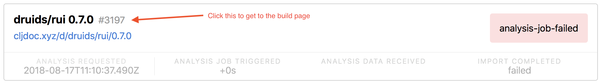

# Fixing cljdoc builds

In order for cljdoc to show API documentation we need to analyse each project. This analysis can fail for a variety of reasons:

- missing dependencies 
- analysis ran on an unsupported platform

This document aims to outline some ways for the community to help fix those broken builds. 

> This document is a work in progress and may get out of date more quickly than others.

## Find a broken build

1. Go to https://cljdoc.org/builds
2. Find any build with a red marker on the right (usually "analysis-job-failed")
3. Get to the build page by clicking on the build ID next to the project name: 
4. On the build page you can go the the CI job where you will be  able to see a stack trace and other output that was made during the build.
5. If a namespace is missing there likely is some dependency issue. 



If you're having trouble diagnosing the issue, jump on Slack or open an issue and other folks can help out. 


## Fixing dependency issues

There are two ways to fix dependency issues:

1. Fixing the issue at the source (i.e. the project's `project.clj`, `build.boot` or `deps.edn` file) 
2. Hardcoding a fix for the issue within cljdoc 

Option **1)** should always be done but just doing **1)** won't fix the build for previous releases. This is where **2)** comes in.

#### An Example

Let's assume a project `my/project` has a namespace `project.http` which is considered optional and requires `clj-http.client`. 
Now because that namespace is optional the author of `my/project` did not include `clj-http` in the projects dependencies. It is expected that users add this dependency themselves when using the `project.http` namespace. 

In this situation cljdoc will try to generate API documentation for `project.http` (because it's a namespace included in the jar) but will fail because a required namespace (`clj-http.client`) is missing. 

To fix this in the original project a proper dependency on `clj-http` should be added. If it should not be included by default you can add a `:scope "provided"` qualifier which will exclude that dependency by default but still list it in the project's dependencies (`.pom` file).

```clj
[clj-http "3.9.1" :scope "provided"]
```

Once a new release with this change is made the build should work (assuming no other issues). It's usually a good idea to [test things locally](https://github.com/cljdoc/cljdoc/blob/master/doc/running-cljdoc-locally.adoc). This is part **1)** described above. 

For already released versions we should still do part **2)** in some capacity.

This is where [`deps.clj`](https://github.com/cljdoc/cljdoc/blob/master/modules/shared-utils/src/cljdoc/util/deps.clj) comes in. 

This namespace is generally intended to take care of any manual dependency adjustments.

In most cases a small adjustment to `hardcoded-deps` is probably all that's needed but if you're uncertain, just open a PR and we can work it out together.