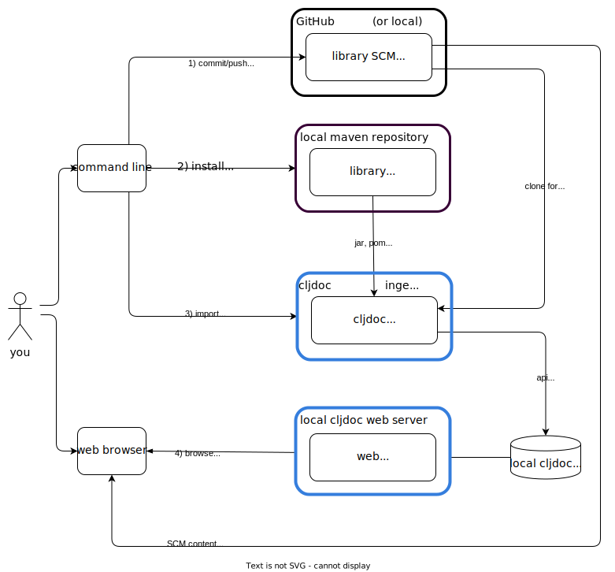

// This doc follows https://asciidoctor.org/docs/asciidoc-recommended-practices/#one-sentence-per-line
// There is a lot of duplication between this doc and running-cljoc-locally-dev.adoc, please update them together
= Running cljdoc Locally for Library Authors
:toc:
:toclevels: 4
:docker-image: cljdoc/cljdoc
// make it easier to update the example project
:example-project-name: cljdoc-exerciser
:example-project-desc: a project the cljdoc team uses to review cljdoc rendering and formatting features
:example-project-link: https://github.com/cljdoc/cljdoc-exerciser[cljdoc-exerciser]
:example-project-local-install: bb install
:example-project-clone-url: https://github.com/cljdoc/cljdoc-exerciser.git
:example-project-import-url: https://github.com/cljdoc/cljdoc-exerciser
:example-project-coords: org.cljdoc/cljdoc-exerciser
:example-project-maven-path: org/cljdoc/cljdoc-exerciser
:example-project-version: 1.0.119

[[introduction]]
== Audience
You are a library author who wants to see what your docs will look like on cljdoc.

Cljdoc developers should instead read link:running-cljdoc-locally-dev.adoc[running cljdoc locally for cljdoc developers].

== Run cljdoc Server Locally via Docker

We use of the very same https://github.com/cljdoc/cljdoc/blob/master/ops/docker/Dockerfile[cljdoc docker] https://hub.docker.com/r/cljdoc/cljdoc/tags[image] that runs in https://cljdoc.org/[production] and avoid any local cljdoc source setup.

=== Prerequisites
You'll need https://www.docker.com/get-started[docker].

=== Launch cljdoc Server

. Fetch any updates for the docker image so that we match what is running in production:
+
[source,shell,subs="verbatim,attributes"]
----
docker pull {docker-image}
----
+
TIP: Your installation might require you to prefix docker commands with `sudo`, add your user to the docker group or adapt as necessary.

. Navigate to your library home dir.
+
[TIP]
====
Our docs use {example-project-link} as an example library.
If you want to follow along using {example-project-name}:

[source,shell,subs="verbatim,attributes"]
----
git clone {example-project-clone-url}
cd {example-project-name}
----

Otherwise, cd to your library project root dir.
====

. Make a directory for the cljdoc sqlite database:
+
[source,shell]
----
mkdir -p .cljdoc-preview
----
+
NOTE: We previously encouraged `/tmp/cljdoc` but current versions of docker need special config to use non-user dirs.

. Start the cljdoc docker web server:
+
[source,shell,subs="verbatim,attributes"]
----
docker run --rm \
  --publish 8000:8000 \
  --volume "$HOME/.m2:/root/.m2" \
  --volume ./.cljdoc-preview:/app/data \
  --platform linux/amd64 \
  {docker-image}
----
+
NOTE: Leave this terminal open. Open a separate terminal shell for any other work.

== Import a Library's Docs
Here's an overview of importing library docs when running cljdoc locally:

NOTE: In the discussions that follow, we'll assume that your hosted SCM (Source Code Management) system is GitHub.

TIP: If your project has link:/doc/userguide/for-library-authors.adoc#module-support[sub modules], you'll need to ingest each of the sub modules in order to see their APIs on your locally running cljdoc web server.

=== Example Library
We have chosen {example-project-link}, {example-project-desc}, as our example import library.
Feel free to substitute your own, or another, library when walking through examples.

=== Importing a Published Library
If you have an unpublished work in progress you'd like to import for preview, instead see <<importing-unpublished-library>>.

Steps 1 and 2 don't apply here, we can move directly to steps 3 then 4.

[TIP]
====
If you have been testing {example-project-name} {example-project-version} locally, be sure to first delete it from your local maven repository.

[source,shell,subs="verbatim,attributes"]
----
rm -rf ~/.m2/repository/{example-project-maven-path}/{example-project-version}
----
====

To import {example-project-name} {example-project-version}:

[source,shell,subs="verbatim,attributes"]
----
docker run --rm \
  --volume "$HOME/.m2:/root/.m2" \
  --volume ./.cljdoc-preview:/app/data \
  --platform linux/amd64 \
  --entrypoint clojure \
  {docker-image} -Sforce -M:cli ingest \
    --project {example-project-coords} \
    --version {example-project-version}
----

You can now <<browse>>.

[[importing-unpublished-library]]
=== Importing an Unpublished Library

If you are going to walk through the examples, you'll want to clone {example-project-link}.
Fork it if you want to walk though pushing changes for a full preview.

All example commands assume you are running from your library project root dir.

[TIP]
====
Repeat steps 1 through 4 as needed (see overview diagram).
Confusion can usually be resolved by asking:

* Did I remember to commit/push to GitHub?
* Did I remember to install to my local maven repository?
====

==== Step 1) Commit/Push Library Changes
Cljdoc only imports from 2 sources: your jar file and your GitHub repo.

[TIP]
====
If you want a full preview where you can verify that references to your GitHub repo work work, then you'll need to push your commits to GitHub.
References to GitHub include:

* links from articles and docstrings to articles, images, etc.
* links from API vars and functions to back to their source on GitHub
====

==== Step 2) Install Library Locally
Cljdoc will find your jar file in your local maven repo.
To publish {example-project-name} to your local maven repository, run:

[source,shell,subs="verbatim,attributes"]
----
{example-project-local-install}
----

[TIP]
====
The command issued to install a library to the local maven repo varies by build technology (leiningen, boot, tools deps cli, etc) and project.
The `{example-project-local-install}` command is appropriate for {example-project-name}, be sure to use the appropriate command for your project.
====

==== Step 3) Import Library Docs
Normally cljdoc will look in your published library's `pom.xml` under `project/scm` to learn what GitHub `url` and `tag` it should use to reference articles and source code.
To avoid having to alter your `pom.xml` while testing changes during development, the cljdoc `ingest` command provides:

* `--git` to override `pom.xml` `project/scm/url`
* `--rev` to override `pom.xml` `project/scm/tag`

You have a choice on how to handle relative references from docs to other files (e.g. images, source code, etc) in your library's GitHub repository when testing locally:

* *Quick preview* `--git` specifies your library's root directory on your local filesystem.
+
WARNING: In a quick preview, relative references to GitHub WON'T work.
+
From {example-project-name}'s root dir:
+
[source,shell,subs="verbatim,attributes"]
----
docker run --rm \
  --volume $(pwd):/repo-to-import \
  --volume "$HOME/.m2:/root/.m2" \
  --volume ./.cljdoc-preview:/app/data \
  --platform linux/amd64 \
  --entrypoint clojure \
  {docker-image} -Sforce -M:cli ingest \
    --project {example-project-coords} \
    --version {example-project-version} \
    --git /repo-to-import \
    --rev $(git rev-parse HEAD)
----

* *Full preview* `--git` specifies your library's https GitHub project URL.
+
NOTE: In a full preview, relative references to GitHub DO work.
+
TIP: Change `pass:a[{example-project-import-url}]` to your own org if you have forked {example-project-name}.
+
From {example-project-name}'s root dir:
+
[source,shell,subs="verbatim,attributes"]
----
docker run --rm \
  --volume "$HOME/.m2:/root/.m2" \
  --volume ./.cljdoc-preview:/app/data \
  --platform linux/amd64 \
  --entrypoint clojure \
  {docker-image} -Sforce -M:cli ingest \
    --project {example-project-coords} \
    --version {example-project-version} \
    --git {example-project-import-url} \
    --rev $(git rev-parse HEAD)
----

[[browse]]
==== Step 4) Browse Library Docs
The final step is you browsing the imported library docs in your web browser.
For example, after importing version {example-project-version} of {example-project-name} you'd browse the docs locally via: +
http://localhost:8000/d/{example-project-coords}/{example-project-version}

[NOTE]
====
When testing locally, you may also want verify what your library docs look like as an offline bundle: +
http://localhost:8000/download/{example-project-coords}/{example-project-version}.
====

== Example Docker Scripts
The above examples show the minimal commands to run cljdoc under docker and almost beg for scripting.
You might find inspiration/ideas from {example-project-link}'s https://github.com/cljdoc/cljdoc-exerciser/blob/master/script/cljdoc_preview.clj[cljdoc_preview.clj]

*Thats pretty much it!* Stop by on Slack if you have any problems!
