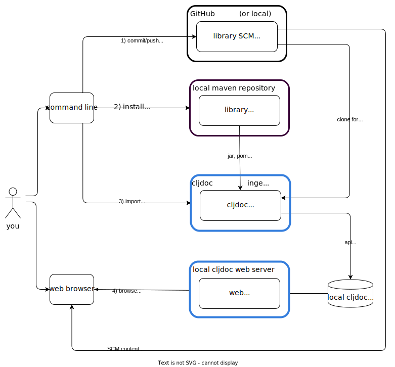

// This doc follows https://asciidoctor.org/docs/asciidoc-recommended-practices/#one-sentence-per-line
= Running cljdoc locally
:toc:
:toclevels: 4
:docker-image: cljdoc/cljdoc
// make it easier to update the example project
:example-project-name: cljdoc-exerciser
:example-project-desc: a project the cljdoc team uses to review cljdoc rendering and formatting features
:example-project-link: https://github.com/cljdoc/cljdoc-exerciser[cljdoc-exerciser]
:example-project-local-install: bb install
:example-project-update-pom: script/update-pom
:example-project-clone-url: https://github.com/cljdoc/cljdoc-exerciser.git
:example-project-import-url: https://github.com/cljdoc/cljdoc-exerciser
:example-project-coords: org.cljdoc/cljdoc-exerciser
:example-project-version: 1.0.71

[[introduction]]
== Introduction
There are different motivations for running cljdoc locally on your computer:

1. You are a *cljdoc developer* wanting to contribute to cljdoc itself.
You will want to <<run-cljdoc-locally-from-source>>.

2. You are a *library author* interested in verifying that your docs look good before publishing.
You can opt to:

** <<run-cljdoc-locally-from-docker>> to avoid any local source setup
** or <<run-cljdoc-locally-from-source>>

Regardless of the path you take, after you start cljdoc locally, you'll need to <<import-a-library>> so you have something to test against.

[[run-cljdoc-locally-from-source,run cljdoc locally from source]]
== Run cljdoc Locally From Source (cljdoc developer)
This is the path to take for a *cljdoc developer*. +
While it is also a viable path for a *library author*, a library author might prefer to <<run-cljdoc-locally-from-docker>>.

=== Prerequisites
To run cljdoc from source, you must first install these dependencies:

* https://nodejs.org/en/[Node.js]
* https://adoptium.net/?variant=openjdk17&jvmVariant=hotspot[Java Development Kit 17] - the cljdoc web server currently runs on JDK17 in production, so ideally, you'll want to be developing with JDK17 too.
Example of a valid JDK:
+
[source,sh]
----
$ java -version
openjdk version "17.0.1" 2021-10-19
OpenJDK Runtime Environment Temurin-17.0.1+12 (build 17.0.1+12)
OpenJDK 64-Bit Server VM Temurin-17.0.1+12 (build 17.0.1+12, mixed mode, sharing)
----
* https://clojure.org/guides/getting_started[Clojure CLI tools] - make sure you have upgraded to the current version
* https://github.com/babashka/babashka[Babashka] - some of our scripts are written in babashka
* https://git-scm.com[Git]

=== Setup cljdoc

1. Clone cljdoc (adjust as appropriate when you are working from a fork of cljdoc)
+
[source,shell]
----
git clone https://github.com/cljdoc/cljdoc.git
cd cljdoc
----

1. Build the JavaScript files used by the cljdoc pages:

** If you want to replicate production:
+
[source,shell]
----
npm ci                 # reproducibly install packages into node_modules
npm run format         # format JS code with Prettier
npm run build          # production build
----
+
Check that `resources-compiled` folder was generated.

** If you are a developer planning to work on JavaScript files (instead of `npm run build` we have `npm run dev`):
+
[source,shell]
----
npm ci                 # reproducibly install packages into node_modules
npm run format         # format JS code with Prettier
npm run dev            # watch mode for automatic rebuilding of JavaScript files
----
+
NOTE: Leave watch mode session open. Continue any work in a separate terminal shell.
1. Start the cljdoc web server
+
[source,shell]
----
./script/cljdoc run
----
+
NOTE: Leave this web server session open. Continue any work in a separate terminal shell.
+
Alternatively you can start a REPL with `clj` (or your favorite editor integration), then load the system, move into its namespace and start the server:
+
[source,clojure]
----
(require '[cljdoc.server.system])
(in-ns 'cljdoc.server.system)
(require '[integrant.repl])
(integrant.repl/set-prep! #(system-config (cfg/config)))
(integrant.repl/go)
----

1. (Optional, but recommended) Run tests.
It is recommended that you run tests before making any changes.
This way you'll be pretty sure that the cljdoc main branch and your local setup are sound.
From the cljdoc directory:
+
[source,clojure]
----
clojure -M:test
----

[[run-cljdoc-locally-from-docker,run cljdoc locally from docker]]
== Run cljdoc Locally From Docker (library author)

If you are a *library author*, this path is for you; *cljdoc developers* need to <<run-cljdoc-locally-from-source>>.

Here we make use of the very same https://github.com/cljdoc/cljdoc/blob/master/ops/docker/Dockerfile[cljdoc docker] https://hub.docker.com/r/cljdoc/cljdoc/tags[image] that runs in https://cljdoc.org/[production] and avoid any local cljdoc source setup.

=== Prerequisites
You'll need https://www.docker.com/get-started[docker].

=== Setup cljdoc docker
TIP: Your installation might require you to prefix docker commands with `sudo`, add your user to the docker group or adapt as necessary.

1. Fetch any updates for the docker image so that we match what is running in production:
+
[source,shell,subs="verbatim,attributes"]
----
docker pull {docker-image}
----

2. Make a directory for the cljdoc sqlite database:
+
[source,shell]
----
mkdir -p /tmp/cljdoc
----

3. Start the cljdoc docker web server:
+
[source,shell,subs="verbatim,attributes"]
----
docker run --rm \
  --publish 8000:8000 \
  --volume "$HOME/.m2:/root/.m2" \
  --volume /tmp/cljdoc:/app/data \
  {docker-image}
----
+
NOTE: Leave this terminal open. Open a separate terminal shell for any other work.

[[import-a-library,import a library's docs]]
== Import a Library's Docs
Before importing a library for local testing, you will have decided if you want to <<run-cljdoc-locally-from-source>> or <<run-cljdoc-locally-from-docker>>.
See the <<introduction>> section on how to make that choice.

Here's an overview of importing library docs when running cljdoc locally:

Note:

* A *cljdoc developer* won't necessarily want to work with a local library; they can skip to step 3 and <<import-a-published-library>>.
* In the discussions that follow, we'll assume that your hosted SCM (Source Code Management) system is GitHub.

IMPORTANT: If your project has link:/doc/userguide/for-library-authors.adoc#module-support[sub modules], you'll need to ingest each of the sub modules in order to see their APIs on your locally running cljdoc web server.

=== Example Library
We have chosen {example-project-link}, {example-project-desc}, as our example import library.
Feel free to substitute your own, or another, library when walking through examples.

=== The ingest Command
The cljdoc command line tool includes an `ingest` command.
You will use this command to import a library's documentation into cljdoc when working locally.

All example commands assume you are running from your library project root dir, and that if you are running from cljdoc source, both projects share the same parent dir.

The sections that follow include example commands for running from cljdoc source and docker.
For example to get help on the ingest command:

[cols="2*"]
|===
|from source| from docker

a|
[source,shell,subs="verbatim,attributes"]
----
../cljdoc/script/cljdoc ingest --help
----

a|
[source,shell,subs="verbatim,attributes"]
----
docker run --rm \
  --entrypoint clojure {docker-image} \
  -M:cli ingest --help
----
|===

TIP: Your installation might require you to prefix docker commands with `sudo`, adapt as necessary.

=== Steps

[TIP]
====
Repeat steps 1 through 4 as needed (see overview diagram).
Confusion can usually be resolved by asking:

* Did I remember to commit/push?
* Did I remember to publish locally?
====

[[setup,setup]]
==== Setup)
If you just want to import an existing libary, jump to <<import-a-published-library>>.

If you are going to walk through the examples, you'll want to clone {example-project-link}.
Fork it if you want to walk though pushing changes for a full preview.

==== Step 1) Commit/Push Library Changes
Cljdoc only imports from committed changes, this means you'll need to commit any changes before import.

If you want a full preview where relative GitHub references (links to images, source code, etc) work, then you'll also want to push your commits to GitHub.

==== Step 2) Publish Library Locally
After <<setup>>, to publish {example-project-name} to your local maven repository, run:

[source,shell,subs="verbatim,attributes"]
----
{example-project-local-install}
----

The command issued to install a library to the local maven repo varies by build technology (leiningen, boot, tools deps cli, etc) and project.
The `{example-project-local-install}` command is appropriate for {example-project-name}, be sure to use the appropriate command for your project.

==== Step 3) Import Library Docs
We go over a few different import scenarios:

[[import-a-published-library,import a published library]]
===== Import a Published Library
You want to import library docs for a publicly published library.
This is a likely scenario for a *cljdoc developer*.

TIP: If you have been testing {example-project-name} {example-project-version} locally, be sure to first delete it from your local maven repository.

To import {example-project-name} {example-project-version}:
[cols="2*"]
|===
|from source| from docker

a|
[source,shell,subs="verbatim,attributes"]
----
../cljdoc/script/cljdoc ingest \
  --project {example-project-coords} \
  --version {example-project-version}
----

a|
[source,shell,subs="verbatim,attributes"]
----
docker run --rm \
  --volume "$HOME/.m2:/root/.m2" \
  --volume /tmp/cljdoc:/app/data \
  --entrypoint clojure \
  {docker-image} -M:cli ingest \
    --project {example-project-coords} \
    --version {example-project-version}
----

|===

===== Testing docs for a Library During Development
You are in development mode on a library and want to preview what its docs will look like on cljdoc.

Normally cljdoc will look in your published library's `pom.xml` under `project/scm` to learn what GitHub `url` and `tag` it should use to reference articles and source code.
To avoid having to alter your `pom.xml` while testing changes during development, the cljdoc `ingest` command provides:

* `--git` to override `pom.xml` `project/scm/url`
* `--rev` to override `pom.xml` `project/scm/tag`

You have a choice on how to handle relative references from docs to other files (e.g. images, source code, etc) in your library's GitHub repository when testing locally:

* *Quick preview* `--git` specifies your library's root directory on your local filesystem.
+
WARNING: In a quick preview, relative references to GitHub WON'T work.
+
From {example-project-name}'s root dir:
+
[cols="2*"]
|===
|from source| from docker

a|
[source,shell,subs="verbatim,attributes"]
----
../cljdoc/script/cljdoc ingest \
  --project {example-project-coords} \
  --version {example-project-version} \
  --git $(pwd) \
  --rev $(git rev-parse HEAD)
----

a|
[source,shell,subs="verbatim,attributes"]
----
docker run --rm \
  --volume $(pwd):/repo-to-import \
  --volume "$HOME/.m2:/root/.m2" \
  --volume /tmp/cljdoc:/app/data \
  --entrypoint clojure \
  {docker-image} -M:cli ingest \
    --project {example-project-coords} \
    --version {example-project-version} \
    --git /repo-to-import \
    --rev $(git rev-parse HEAD)
----
|===

* *Full preview* `--git` specifies your library's https GitHub project URL.
+
NOTE: In a full preview, relative references to GitHub DO work.
+
TIP: Change `pass:a[{example-project-import-url}]` if you have forked {example-project-name}.
+
From {example-project-name}'s root dir:
+
[cols="2*"]
|===
|from source| from docker

a|
[source,shell,subs="verbatim,attributes"]
----
../cljdoc/script/cljdoc ingest \
  --project {example-project-coords} \
  --version {example-project-version} \
  --git {example-project-import-url} \
  --rev $(git rev-parse HEAD)
----

a|
[source,shell,subs="verbatim,attributes"]
----
docker run --rm \
  --volume "$HOME/.m2:/root/.m2" \
  --volume /tmp/cljdoc:/app/data \
  --entrypoint clojure \
  {docker-image} -M:cli ingest \
    --project {example-project-coords} \
    --version {example-project-version} \
    --git {example-project-import-url} \
    --rev $(git rev-parse HEAD)
----
|===

===== Verifying docs Prior to Publish to Clojars
You are getting ready to release to clojars and want to check for possible configuration errors and verify what your docs will look like on cljdoc.

[TIP]
====
If you have fully automate your deployment, including updating/generating your `pom.xml`, this verification will not apply.
====

When a project is published to clojars its docs are automatically updated on cljdoc.
A not entirely uncommon occurrence is a malconfigured `project/scm` in `pom.xml` and therefore wrong or missing references to GitHub.

To test your scm settings before release to clojars:

1. Commit and push all your changes to GitHub
2. Update your `pom.xml` `project/version` and `project/scm` appropriately.
  * Do this manually or via whatever tooling you use to do that, for {example-project-name} run `{example-project-update-pom}`.
  * Update `pom.xml` `project/scm/url` if you are working from a fork.
3. Publish your library to your local maven repo
  * For {example-project-name} run `{example-project-local-install}`.

Then test your via a cljdoc `ingest` that omits `--git` and `--rev`. This way, cljdoc will use the values in your `pom.xml`.

From {example-project-name}'s root dir:
[cols="2*"]
|===
|from source| from docker

a|
[source,shell,subs="verbatim,attributes"]
----
../cljdoc/script/cljdoc ingest \
  --project {example-project-coords} \
  --version {example-project-version}
----

a|
[source,shell,subs="verbatim,attributes"]
----
docker run --rm \
  --volume "$HOME/.m2:/root/.m2" \
  --volume /tmp/cljdoc:/app/data \
  --entrypoint clojure \
  {docker-image} -M:cli ingest \
    --project {example-project-coords} \
    --version {example-project-version}

----
|===

==== Step 4) Browse Library Docs
The final step is you browsing the imported library docs in your web browser.
For example, after importing version {example-project-version} of {example-project-name} you'd browse the docs locally via: +
http://localhost:8000/d/{example-project-coords}/{example-project-version}

== Offline Bundles
When testing locally, you may also want verify what a library docs look like as an offline bundle.

The cljdoc command line tools includes an `offline-bundle` command, but it is probably easier to just use your local running cljdoc web server to generate the offline bundle.

You'll want to first start a cljdoc server, then <<import-a-library>>.

Assuming {example-project-name} version {example-project-version} navigate to: +
http://localhost:8000/download/{example-project-coords}/{example-project-version}.

== Example Docker Scripts
The above examples show the minimal commands to run cljdoc under docker and almost beg for scripting.
Here are some example scripts from the wild:

* https://github.com/borkdude/clj-kondo/blob/master/script/cljdoc-preview[clj-kondo]
* https://github.com/lread/rewrite-cljc-playground/blob/master/script/cljdoc_preview.clj[rewrite-cljc]

*Thats pretty much it!* Stop by on Slack if you have any problems!
