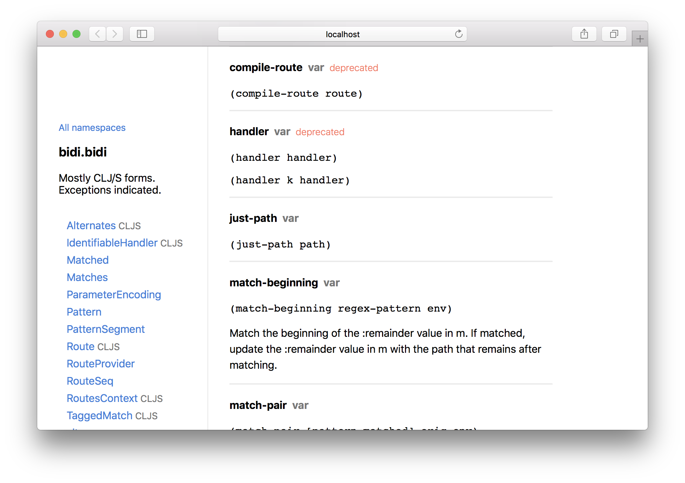

Hello everyone following along! :wave:

This is intended as an update so you know what has been going on.

First of all, something to see (don't get settled on it, I expect things to change a lot):

Over the last two weeks I created a system that runs [Codox](https://github.com/weavejester/codox) on arbitrary Jars from Clojars and stores metadata about them in a [Grimoire](https://github.com/clojure-grimoire/lib-grimoire) store. Think of the Grimoire store as a global repository of static analysis done on Clojure code. The :sparkles: **plain data** :sparkles: inside that store can help answer questions like:

- What functions are available in a namespace for a given platform?
- What namespaces are in an artifact?

And will allow us to build various tools on top, including: static HTML pages (see picture), Docsets for documentation browsers, single page apps.

I've also had a very productive chat with Reid McKenzie  (@arrdem, author of Grimoire) about how we could extend the Grimoire data model to accommodate non-API documentation. This is something Reid has been thinking about for a long time and so the discussion with him has been invaluable. I'd really like to see this done for a v1 of this project.

In the last 6 days I authored 116 commits and [wrote five Architecture Decision Records](https://github.com/martinklepsch/clj-docs/tree/master/doc/adr)  ([?](http://thinkrelevance.com/blog/2011/11/15/documenting-architecture-decisions)) hoping that this may make it easier for others to trace my decision making. The repo is two weeks old but most of the work has been done in the last week.

I also talked to Daniel Compton who is part of the Clojars team and he outlined the possibility of transitioning this project into the Clojars organisation to ensure it's longevity (yay!). Nothing is set in stone and there's still a lot more work to do though.

While the README has served as a TODO list so far it seems that this is a good time to also adopt some processes that work better with additional contributors. In the coming days I will add a `CONTRIBUTING.md` file, create issues and establish some basic tag hierarchy. I hope this helps people interested in contributing find the kind of stuff they enjoy working on.

Maybe I'm just a little over-hyped by working a bit too much on this but — if my current vision for this doesn't have any major blockers — Clojure/Script should have some of the best documentation tooling out there once we're "done" here.

:v: Martin

