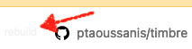

= Cljdoc for Library Authors
:toc:
:toclevels: 3

== Why Cljdoc?

Cljdoc offers a centralized hosted library of docs which:

* Are easy to publish
* Automatically stay up to date
* Are discoverable by users
* And look good!

[[basic-setup]]
== The Bare Minimum

If you publish your library to https://clojars.org[Clojars], its docs should already be available (or available to build) on https://cljdoc.org[cljdoc.org].

Default handling:

* link:#api[API] automatically documented
* link:#articles[Articles] include `README`, `CHANGELOG` and articles under `doc/` (else `docs/`), see link:#auto-discovered-articles[auto-discovered articles]

NOTE: Cljdoc currently only processes libraries that have been deployed to clojars. 
We do have https://github.com/cljdoc/cljdoc/issues/459[ideas for processing source-based libraries], but have not implemented yet.

== Mechanics

When cljdoc is link:#triggers[triggered] to build your library's documentation, it:

. Downloads your library's release jar from Clojars
. Analyzes your library's link:#git-sources[sources on git]
. Analyzes your library's jar to discover its public link:#api[API].

After building your docs, they are available at https://cljdoc.org[cljdoc.org] for online and link:for-users.md#offline-docs[offline] browsing.

See also: link:/doc/cljdoc-developer-technical-guide.adoc#system-overview[System Overview].

[[markup]]
== Markup Formats

Cljdoc supports two markup formats:

* *Markdown* for API link:#docstrings[docstrings] and `.md` link:#articles[articles]
** We use https://github.com/vsch/flexmark-java[flexmark-java] to render a https://github.github.com/gfm/[GitHub flavored CommonMark dialect].
* *AsciiDoc* for `.adoc` link:#articles[articles]
** We use https://github.com/asciidoctor/asciidoctorj[AsciidoctorJ] to render https://docs.asciidoctor.org/asciidoc/latest/[AsciiDoc].

[[badges]]
== Cljdoc Badge
[IMPORTANT]
====
The following examples use `metosin/malli`.
Replace with your library's Clojars [.nowrap]#`group-id/artifact-id`# (hint: not the GitHub org/repo name).
====

Include a cljdoc badge in your README. Here malli's badge:
https://cljdoc.org/d/metosin/malli[image:https://cljdoc.org/badge/metosin/malli[cljdoc badge]].

* Badge URL: `https://cljdoc.org/badge/metosin/malli`
* Docs homepage URL: `https://cljdoc.org/d/metosin/malli`

Expressed in Markdown:
[source%nowrap,markdown]
----
[](https://cljdoc.org/d/metosin/malli)
----
and AsciiDoc:
[source,asciidoc]
----
https://cljdoc.org/d/metosin/malli[image:https://cljdoc.org/badge/metosin/malli[cljdoc badge]]
----

[[git-sources]]
== Git Sources

Cljdoc starts with the release jar downloaded from Clojars.
A jar is associated with its specific git revision of sources via the `<scm>` entry in the jar's `pom`.
This allows cljdoc to consult git hosted:

* link:#cljdoc-config[cljdoc config] - options on how cljdoc should process your docs
* link:#articles[articles] - to include and present as part of your docs
* sources files - to allows cljdoc to intelligently link back to articles, link:#api[API] source code, and your git repo

TIP: a valid `pom` `<scm>` also allows other services like Clojars to point back to your release's sources.

[NOTE]
====
* SCM stands for Source Control Management
* pom is the Maven Project Object Model
====

An example `<scm>` entry from `metosin/malli`:

[source,xml]
----
  <scm>
    <url>https://github.com/metosin/malli</url>
    <connection>scm:git:git://github.com/metosin/malli.git</connection>
    <developerConnection>scm:git:ssh://git@github.com/metosin/malli.git</developerConnection>
    <tag>0.8.4</tag>
  </scm>
----

Another from `juxt/bidi`:
[source,xml]
----
  <scm>
    <url>https://github.com/juxt/bidi</url>
    <connection>scm:git:git://github.com/juxt/bidi.git</connection>
    <developerConnection>scm:git:ssh://git@github.com/juxt/bidi.git</developerConnection>
    <tag>d1bfcc9c4fe247b8ada19cd7ee25acd81dd93f26</tag>
  </scm>
----

Cljdoc will look at the `<url>` and the `<tag>`:

* `<url>` points to your hosted git repo
* `<tag>` is a valid pointer to the git revision of your release's sources.
It can be a git tag, or commit sha.

TIP: You can optionally link:#override-config[override] the revision for articles and docstring format.

NOTE: We strongly recommend you explicitly specify the `<tag>` in your `pom.xml` for cljdoc and other tools. +
But... If you do not specify a `<tag>`, cljdoc will search for a version tag based on the artifact version.
For artifact version `1.2.3` it will look for a git tag `1.2.3` (else `v1.2.3`).

NOTE: Cljdoc will assume a found version tag is equivalent to `<tag>` even when the `<tag>` specifies a commit sha.

Here are some common ways folks set `<scm>` values:

* By hand. You can edit a `pom.xml` manually when cutting a release, but this can be error-prone.
* https://clojure.org/guides/tools_build[Clojure tools build] can be asked to populate the `<scm>` value.
Cybermonday provides https://github.com/kiranshila/cybermonday/blob/17bb2c412171283440276a0a8e2cfd6f252aad91/build/build.clj#L27-L30[a good example of doing just that].
* https://leiningen.org/[Leiningen] will automatically create the `<scm>` entry for you if you set the https://github.com/technomancy/leiningen/blob/bd3ecfcfb20ef7a79912879ff892e0f2317e8691/sample.project.clj#L490[`:scm` in your `project.clj`].
For example:
+
[source,clojure]
----
    :scm {:name "git" :url "https://github.com/your-github-org/your-project"}
----
* https://github.com/boot-clj/boot[Boot] also has support, pass the `:scm` option to the `pom` task, an https://github.com/martinklepsch/derivatives/blob/f9cc6be8eeaf21513641cb09d5a466e34ecdd565/build.boot#L18-L23[example].

Whatever method you choose, take care to ensure that your jar's pom points back to the exact revision of its sources on git.

[[override-config]]
=== Overriding Cljdoc Config & Articles
Sometimes you'll want cljdoc to present minor adjustments after your library's release commit.
For examples:

* a README that includes the git sha of the release will necessarily appear in a commit after the library release.
* perhaps you'd like fix or edit an article without cutting a new release
* you'd like to adjust your link:#cljdoc-config[article table of contents]
* you might also want to change how link:#docstrings[cljdoc presents docstrings].

To support these scenarios, cljdoc recognizes the `cljdoc-<version>` git tag.
For library version `1.2.3` cljdoc will look for git tag `cljdoc-1.2.3` (or `cljdoc-v1.2.3`) and import your articles from that commit instead of the link:#git-sources[default commit].

If you add/move a `cljdoc-<version>` tag after the initial cljdoc build is complete, you can request a link:#rebuild[rebuild].

TIP: This affects all of and only: docstring format, article table of contents, and articles.
Any changes, for example, to docstring content will require a new library release.

TIP: You'll want to make any adjustments before you start working on your next release.
All articles are re-imported.

[[cljdoc-config]]
== Configuration

When building your docs, cljdoc will look under the `doc` (else `docs`) directory for a `cljdoc.edn` file in your link:#git-sources[library's git repo].

You can use this configuration file to tell cljdoc more about your documentation.

* `:cljdoc.doc/tree` - Tells cljdoc what link:#articles[articles] to present and in what hierarchy. +
By default, cljdoc will link:#auto-discovered-articles[automatically discover articles].
* `:cljdoc/languages` - Tells cljdoc which link:#languages[languages] your API uses. +
By default, cljdoc will automatically detect languages based on the sources it finds in your jar.
* `:cljdoc/docstring-format` - Tells cljdoc how you'd like your link:#docstrings[docstrings] displayed. +
By default, cljdoc will render docstrings from link:#markup[Markdown format].
* `:cljdoc/include-namespaces-from-dependencies` - Tells cljdoc to amalgamate API docs from multiple link:#modules[modules]. +
Rarely used, but very useful when your project is made up of modules.

As an example, a version of https://github.com/seancorfield/honeysql[honeysql]'s `cljdoc.edn`
[source,Clojure]
----
{:cljdoc.doc/tree
 [["Readme" {:file "README.md"}]
  ["Changes" {:file "CHANGELOG.md"}]
  ["Getting Started" {:file "doc/getting-started.md"}
   ["General Reference" {:file "doc/general-reference.md"}]
   ["SQL Clause Reference" {:file "doc/clause-reference.md"}]
   ["SQL Operator Reference" {:file "doc/operator-reference.md"}]
   ["SQL 'Special Syntax'" {:file "doc/special-syntax.md"}]
   ["PostgreSQL Support" {:file "doc/postgresql.md"}]
   ["Extending HoneySQL" {:file "doc/extending-honeysql.md"}]]
  ["Differences from 1.x" {:file "doc/differences-from-1-x.md"}]]}
----

== Linking to docs on cljdoc
See also: link:#badges[badges].

TIP: If you are link:/doc/running-cljdoc-locally.adoc[locally previewing your docs], there's no need to replace `\https://cljdoc.org` with some `localhost` version.
Cljdoc will automatically make these URLs work locally.

[[link-articles]]
=== Link to articles

* When linking from article to link:#articles[article], use relative or root-relative links.
Cljdoc will rewrite built article to article links automatically. Markdown examples:
** `[root relative link](/doc/some-doc.md)`
** `[relative link](other-doc.md)`
* When linking from docstring to article, use root relative links. Markdown example:
** `[root relative link](/doc/some-doc.md)`
* When linking from outside your git repo:
** doc home page
*** `https://cljdoc.org/d/metosin/malli`
** a specific doc in the current release, uses link:#slugs[article slugs]
*** `https://cljdoc.org/d/metosin/malli/CURRENT/doc/changelog`
** a specific doc for release `0.7.5`, uses link:#slugs[article slugs]
*** `https://cljdoc.org/d/metosin/malli/0.7.5/doc/readme`

=== Link to API docs
Sometimes you'll want to link to a var or a namespace in your library's API docs on cljdoc.

[[wikilink]]
==== Use API Wikilinks from docstrings

You can link to other namespaces and functions within your libary from your markdown docstrings using the `\[[wikilink]]` syntax.

Examples:

[%autowidth]
|===
|Wikilink | Links to API docs for

a|`\[[some-fn]]` a| `some-fn` var in the current namespace
a|`[[my-lib.ns1/some-other-fn]]` a| `some-other-fn` var in the `my-lib.ns1` namespace
a| `\[[my-lib.ns1]]` a| `my-lib.ns1` namespace

|===


[NOTE]
====
* Wikilinks only work from docstrings.
* Namespace aliases are not considered.
We don't want to burden the reader to have to understand what namespace an alias maps to.
* There is some support for relative linking to vars in other namespaces
For example you can link to `compojure.core/GET` from `compojure.route` via `[[core/GET]]`.
Frankly I feel this is more confusing than helpful for both authors and readers and recommend the fully qualified `[[compujure.core/GET]]`
====

==== Use full API URLS from articles

Use the full cljdoc API URL when linking to from an article or from outside your git repo.

For example to link to namespace `malli.core` in version 0.7.5 use: +
`https://cljdoc.org/d/metosin/malli/0.7.5/api/malli.core`

You can replace the explicit version with `CURRENT`.
For example, to link to `malli.core/explain` in the current version use: +
`https://cljdoc.org/d/metosin/malli/CURRENT/api/malli.core#explain`

`CURRENT` will be replaced with:

* the current version the user is already viewing on cljdoc
* the latest available version of the library when the user is navigating to cljdoc from some outside source

[[api]]
== API Documentation

=== Declaring your Public API

Cljdoc will document all namespaces and public vars it finds.
To exclude namespaces and/or vars from API documentation, annotate them with `:no-doc` metadata:

[source,clojure]
----
(defn ^:no-doc hidden "Won't see me on cljdoc.org!" [x])
----

[source,clojure]
----
(ns ^:no-doc namespace.hidden
  "This ns shouldn't show in the docs.")
----

[source,clojure]
----
(ns namespace.hidden
  "This ns shouldn't show in the docs."
  {:no-doc true})
----

[[languages]]
=== API Languages
Cljdoc will auto-detect which languages your library supports based on the types of source files it finds.
You can choose to override this auto-detection in your `doc/cljdoc.edn` file via the `:cljdoc/languages` option.

|===
| Example `:cljdoc/languages` value | API Analysis run for

a| `["clj"]` | Clojure only
a| `["cljs"]` | ClojureScript only
a| `["clj" "cljs"]` | Both Clojure and ClojureScript
a| `:auto-detect` | Dependent upon source files found in your library,
the default behavior.
|===

Example usage:
[source,Clojure]
----
{:cljdoc/languages ["clj"]}
----

=== Getting Dependencies Right

Cljdoc discovers your API via dynamic runtime analysis.
It will try to load all namespaces found in your jar.
If a dependency is not found, the load, and therefore API analysis, will fail.

If you include namespaces that require additional/optional dependencies, make sure you declare them in your `pom.xml`.

If these dependencies are expected to be provided by, for example, some container or JVM, mark them with a `scope` of `"provided"` in our `pom.xml`.
Provided dependencies are skipped at runtime, but inform cljdoc they are required for API analysis.

TIP: You can express `provided` in a `project.clj`, for https://github.com/funcool/cats/blob/d1b7f3d60c7791798182937c54cbafa4e81536d4/project.clj#L6-L12[example].
The `deps.edn` file does not support scoping, you'll have to express these directly in your `pom.xml`.

Cljdoc will automatically search Clojars and Maven Central for dependencies.
If any of your library's dependencies are hosted elsewhere, those maven repositories will need to be specified in your `pom.xml`.
This includes any transitive dependencies.

[TIP]
====
You can specify maven repositories:

* in a `project.clj` under `:repositories`, for https://github.com/IamDrowsy/cloudship/blob/93ebdf7fdb1f404436ccdb68fafc8cd4f88ab256/project.clj#L30[example].
* in a `deps.edn` under `:mvn/repos`, for https://github.com/phronmophobic/membrane.term/blob/d1c8eb6f682b797e371fe8a6e9e1e9caf7dbc79b/deps.edn#L20-L21[example].
====

[[docstrings]]
=== Docstrings

Docstrings are rendered from link:#markup[Markdown] by default.

You can choose to override this behaviour in your `doc/cljdoc.edn` file via the `:cljdoc/docstring-format` option.
Valid values are:

* `:markdown` - the default, an option to view "raw docstring" as plaintext is available to the user.
* `:plaintext` - presents only the raw docstring.

Consider https://www.martinklepsch.org/posts/writing-awesome-docstrings.html[these recommendations] when writing your docstrings in markdown format:

1. Backtick-Quote ``` function arguments & special keywords to `make` them `stand` out `more`
2. Link to other functions using link:#wikilink[`+[[wikilink]]+`] syntax
3. Include small examples using markdown fenced `\```Clojure ... ```` code blocks 
4. Use Markdown tables to describe complex options maps
5. You can include images and links to articles, just be sure to use git repo root-relative links (links that start with a `/`):
  * ``
  * `[my article](/dir1/dir2/article.adoc)`

Any HTML embedded within docstrings is escaped.

[[articles]]
== Article Documentation

Libraries often include additional guides and tutorials in link:#markup[markup] files.
Cljdoc calls these articles.

For cljdoc to find your articles:

* They must be stored inside your project's git repository
* Your git repository must be link:#git-sources[properly linked to your git sources]

This allows cljdoc to retrieve article files at the revision/commit of the release.

=== Automatic Link Rewriting

Cljdoc hosted articles will have their links link:#link-articles[rewritten to link back to cljdoc].
All links that work on GitHub should also work on cljdoc.

[[auto-discovered-articles]]
=== Auto-discovered Articles

If your git repository does not contain a link:#article-config[doc tree configuration], cljdoc will automatically include:

* `README.md` else `README.adoc` - filename search is case insensitive
** Title is `Readme`
* `CHANGELOG.md` else `CHANGELOG.adoc`- filename search is case insensitive
** Title is `Changelog`
* link:#markup[Markup] articles from your `doc/` else `docs/` folder
** The title is read from the file's first heading. There will be no nesting and articles will be ordered alphabetically by filename.

TIP: Use filenames prefixed with digits like `01-intro.md` to define the order of articles.

[[article-config]]
=== Configuring Articles

If you need more control, use a `doc/cljdoc.edn` file to specify a tree of articles.

Assuming you have a directory `doc/` in your repository as follows:

----
doc/
  getting-started.md
  installation.md
  configuration.md
----

You can explicitly add these articles to your cljdoc build by with the following `doc/cljdoc.edn` file:

[source,clojure]
----
{:cljdoc.doc/tree [["Readme" {:file "README.md"}]
                   ["Getting Started" {:file "doc/getting-started.md"}
                    ["Installation" {:file "doc/installation.md"}]]
                   ["Configuration" {:file "doc/configuration.md"}]]}
----

Your articles will be presented with the following hierarchy and titles:

----
├── Readme
├── Getting Started
│   └── Installation
└── Configuration
----

TIP: Cljdoc will always present the readme and changelog articles first.

IMPORTANT: The resulting URLs for those articles will be based on the title provided in the `cljdoc.edn` file and _not_ on the filename or title within the article file.

See also: link:#verifying-articles[verifying articles]

[[slugs]]
=== Article Slugs

Slugs for articles are currently based on the article title.
Titles can be link:#article-config[explicitly configured] or link:#auto-discovered-articles[discovered].

=== AsciiDoc Environment

Similar to `env-github` on GitHub, cljdoc will set an `env-cljdoc` attribute when
rendering your AsciiDoc file. This allows you to hide or show sections
of your document or set configuration parameters.

As an example, this AsciiDoctor snippet:
[source,asciidoc,literal]
----
\ifdef::env-cljdoc[]
THIS WILL BE SHOWN ON CLJDOC
\endif::[]
\ifndef::env-cljdoc[]
THIS WILL BE SHOWN EVERYWHERE ELSE
\endif::[]
----

will render as so:

ifdef::env-cljdoc[]
THIS WILL BE SHOWN ON CLJDOC
endif::[]
ifndef::env-cljdoc[]
THIS WILL BE SHOWN EVERYWHERE ELSE
endif::[]

[[verifying]]
== Testing & Verifying

=== Previewing Docs Locally

You can preview what your docs will look like before a Clojars release by link:/doc/running-cljdoc-locally.adoc[running cljdoc locally].

=== Snapshot Builds

If you are already publishing `-SNAPSHOT` releases to Clojars, this can also be a useful way to experiment/preview on cljdoc.

We recommend that you populate `<scm>` `<tag>` in your `pom.xml` with the git commit sha of your snapshot release.

Cljdoc does not automatically build snapshot releases, but they will show up in the library search result.
Upon selecting a snapshot release, cljdoc will offer to build its docset.

By its nature, a snapshot release will likely have many releases under the same version.
You can choose to link:#rebuild[rebuild] for against the current releases.

[[verifying-articles]]
=== Article Verification Script

Sometimes people forget to update the paths after moving files around, we recommend you add the following to your CI setup:

[source,shell]
----
curl -fsSL https://raw.githubusercontent.com/cljdoc/cljdoc/master/script/verify-cljdoc-edn | bash -s doc/cljdoc.edn
----

=== GitHub Action
We have a https://github.com/cljdoc/cljdoc-check-action[Cljdoc check action] you can incorporate into your CI workflows.

[[triggers]]
== Doc Build Triggers

* Automatically
** Every 60 seconds, cljdoc reaches out to clojars to discover new releases.
** Every 10 minutes, it queues new releases to build
* By request at cljdoc.org
** If cljdoc has not already built a requested version of a library, you are given the option to build it from https://cljdoc.org[cljdoc.org].
* By rebuild request at cljdoc.org
[[rebuild]]
** If your docs have already been built, you can request a rebuild via the barely visible rebuild hover link on the top right corner of your library docs page: 
+

* By REST request
** An automated release process can trigger a build via rest link:/doc/docsets.md#trigger-a-build-for-a-project[trigger a cljdoc build via REST].

[[modules]]
== Module Support

Some libraries are made up of submodule libraries.
Cljdoc provides some support for these types of libraries.

=== Almagamating APIs

To include API documentation for some or all of an artifact's submodule artifacts, specify their *maven coordinates* under `:cljdoc/include-namespaces-from-dependencies`:

[source,clojure]
----
{:cljdoc/include-namespaces-from-dependencies
 [metosin/reitit
  metosin/reitit-core
  metosin/reitit-ring
  metosin/reitit-spec
  metosin/reitit-schema
  metosin/reitit-swagger
  metosin/reitit-swagger-ui]}
----

NOTE: To be included, each dependency must also be specified as a maven dependency of the project itself (in the project's `deps.edn`, `project.clj`, etc).
The project's resulting POM file will be used to load API information for the correct version.

TIP: https://github.com/metosin/reitit[Reitit] is a great example reference for a project with submodules.

WARNING: If analysis for a specified dependency has failed or hasn't been run, its API documentation will not appear on cljdoc.

=== Distinctly Configuring

Sometimes a single git repository will be the source for multiple maven/clojars artifacts.
Each of these artifacts will point back to the same single git repository and therefore the same `cljdoc.edn`.

Cljdoc allows for a distinct config for each of these artifacts.
Specify `cljdoc.edn` config as normal for your primary library.
For each submodule libary, include config under symbol `submodule-group-id/submodule-artifact-id`.

Here's an example from https://github.com/steffan-westcott/clj-otel[clj-otel]:

[source,clojure]
----
{:cljdoc/languages ["clj"]
 :cljdoc.doc/tree [["Introduction" {:file "README.adoc"}]
                   ["Tutorial" {:file "doc/tutorial.adoc"}]
                   ["Guides" {:file "doc/guides.adoc"}]
                   ["API & Reference" {:file "doc/reference.adoc"}]
                   ["Concepts" {:file "doc/concepts.adoc"}]
                   ["Examples" {:file "doc/examples.adoc"}]
                   ["Changelog" {:file "CHANGELOG.adoc"}]]
 com.github.steffan-westcott/clj-otel-contrib-aws-resources {:cljdoc.doc/tree [["README" {:file "clj-otel-contrib-aws-resources/README.adoc"}]]}
 com.github.steffan-westcott/clj-otel-contrib-aws-xray-propagator {:cljdoc.doc/tree [["README" {:file "clj-otel-contrib-aws-xray-propagator/README.adoc"}]]}
 com.github.steffan-westcott/clj-otel-exporter-jaeger-grpc {:cljdoc.doc/tree [["README" {:file "clj-otel-exporter-jaeger-grpc/README.adoc"}]]}
 com.github.steffan-westcott/clj-otel-exporter-jaeger-thrift {:cljdoc.doc/tree [["README" {:file "clj-otel-exporter-jaeger-thrift/README.adoc"}]]}
 com.github.steffan-westcott/clj-otel-exporter-logging {:cljdoc.doc/tree [["README" {:file "clj-otel-exporter-logging/README.adoc"}]]}
 com.github.steffan-westcott/clj-otel-exporter-logging-otlp {:cljdoc.doc/tree [["README" {:file "clj-otel-exporter-logging-otlp/README.adoc"}]]}
 com.github.steffan-westcott/clj-otel-exporter-otlp {:cljdoc.doc/tree [["README" {:file "clj-otel-exporter-otlp/README.adoc"}]]}
 com.github.steffan-westcott/clj-otel-exporter-prometheus {:cljdoc.doc/tree [["README" {:file "clj-otel-exporter-prometheus/README.adoc"}]]}
 com.github.steffan-westcott/clj-otel-exporter-zipkin {:cljdoc.doc/tree [["README" {:file "clj-otel-exporter-zipkin/README.adoc"}]]}
 com.github.steffan-westcott/clj-otel-extension-trace-propagators {:cljdoc.doc/tree [["README" {:file "clj-otel-extension-trace-propagators/README.adoc"}]]}
 com.github.steffan-westcott/clj-otel-instrumentation-resources {:cljdoc.doc/tree [["README" {:file "clj-otel-instrumentation-resources/README.adoc"}]]}
 com.github.steffan-westcott/clj-otel-instrumentation-runtime-telemetry-java8 {:cljdoc.doc/tree [["README" {:file "clj-otel-instrumentation-runtime-telemetry-java8/README.adoc"}]]}
 com.github.steffan-westcott/clj-otel-instrumentation-runtime-telemetry-java17 {:cljdoc.doc/tree [["README" {:file "clj-otel-instrumentation-runtime-telemetry-java17/README.adoc"}]]}
 com.github.steffan-westcott/clj-otel-sdk {:cljdoc.doc/tree [["README" {:file "clj-otel-sdk/README.adoc"}]]}
 com.github.steffan-westcott/clj-otel-sdk-extension-jaeger-remote-sampler {:cljdoc.doc/tree [["README" {:file "clj-otel-sdk-extension-jaeger-remote-sampler/README.adoc"}]]}}
----
